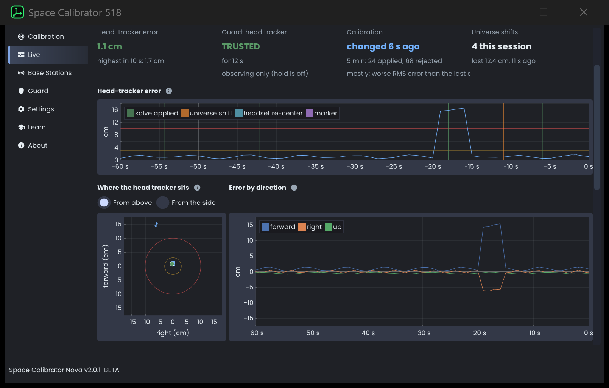

# Space Calibrator 518

A glitch-robust fork of [Space Calibrator 2.0](https://github.com/hyblocker/OpenVR-SpaceCalibrator) for mixed VR setups: a Quest or other inside-out headset together with SteamVR lighthouse trackers and controllers.

<p align="center">
  <a href="https://github.com/Blise518B/SpaceCalibrator518/releases/latest/download/SpaceCalibrator518-Setup.exe">
    
  </a><br>
  <sub><a href="https://github.com/Blise518B/SpaceCalibrator518/releases/latest/download/SpaceCalibrator518-Windows.zip">Portable zip</a> · every version on the <a href="https://github.com/Blise518B/SpaceCalibrator518/releases">Releases</a> page</sub>
</p>



## Why this fork

Space Calibrator keeps the lighthouse playspace lined up with your headset by watching one tracker on your head. Two things knock that over:

- **A glitching tracker.** The head tracker jumps 20 to 30 cm for a few seconds or minutes (reflections, base station mix-ups). The calibration follows it, and your whole body moves away from your head.
- **SteamVR moving its base stations.** SteamVR keeps re-measuring where its base stations are and moves them on its internal map, up to 30 cm at a time. Every tracker tracked from a moved station jumps, although nothing in your room moved. In one recorded four-hour session this happened 68 times, and trackers jumped by more than 2 cm 129 times, by up to 24 cm.

This fork tells these cases apart from real movement and keeps your body where it belongs.

## What it adds

- **Glitch guard.** Every lighthouse device is checked against its own reported velocity and against all the others. A tracker that jumps alone is flagged and recorded; a jump of the whole playspace is corrected at once. Switch on hold in the Guard tab and the calibration is frozen while the head tracker is in doubt, so its glitches can't move your body (off by default until you have checked a few recordings).
- **Base station moves corrected exactly.** The fork reads SteamVR's map changes from the transforms that come with every pose, so it never mistakes them for your movement. Each tracker stays in place when the station it is tracked from moves, and any held offset slides back to SteamVR's map at 1.5 cm/s. In the session above, jumps over 2 cm went from 129 to 0.
- **Remembers where the head tracker sits on the headset.** Learned while everything tracks well and kept between sessions: at every start the calibration is put back onto it as soon as you hold still, solves that would move the tracker on the headset (typical when you lie still) are ignored, and when the tracker sits steadily away from its place, the calibration slides back to it at 1.5 cm/s, without waiting for you to move your head. It leaves a glitching head tracker alone. Replayed over recorded sessions, this halved the time the calibration was more than 3 cm off at the head.
- **Black box recorder.** Records every raw pose. Press F9, the Mark button or hold both triggers when something looks wrong, and the five minutes before and after are saved, with a note of what happened.
- **Live tab.** Real-time graphs of the head tracker error, the guard's verdicts, calibration changes, glitch levels per device and solver health. Every graph explains itself on hover.
- **Trigger hold.** Hold both triggers (1.5 s by default, adjustable in the Guard tab) to shift the calibration back to where the head tracker normally sits on the headset and trust every device again. It works standing still: only the position is corrected, the rotation stays the solver's.
- **Updates without restarting SteamVR.** All logic lives in the overlay; the driver only applies corrections and publishes poses. The overlay starts with SteamVR.
- **Tools** (`tools/`, Python): replay a recording through the guard, analyse a whole session, turn a session into a one-page report.

## Install

1. Download `SpaceCalibrator518-Setup.exe` with the button above and run it. The installer isn't code-signed, so Windows may say it protected your PC: click "More info", then "Run anyway".
2. Close SteamVR when the installer asks you to. It installs for your user only (no admin rights), tells SteamVR to load this driver instead of the Steam version of Space Calibrator (both use the same driver name, so only one of them can be active) and sets the overlay to start with SteamVR.
3. Start SteamVR.

To update, run the newer installer. Uninstalling it (Windows Settings, Apps) switches SteamVR back to the Steam version of Space Calibrator, if you have it; your settings and recordings in `%APPDATA%\space-calibrator` stay.

**Portable zip instead:** unpack [SpaceCalibrator518-Windows.zip](https://github.com/Blise518B/SpaceCalibrator518/releases/latest/download/SpaceCalibrator518-Windows.zip) to a folder that can stay where it is, close SteamVR, double-click `use-fork-driver.bat`, then start SteamVR and run `SpaceCalibrator.exe` once. `use-steam-driver.bat` switches back to the Steam version.

### Build from source

On Windows with Visual Studio 2022 (C++ workload) and CMake 3.24 or newer:

```
git clone --recursive https://github.com/Blise518B/SpaceCalibrator518
cd SpaceCalibrator518
build.bat
```

`build.bat` builds everything into `dist\` and registers the overlay to start with SteamVR. Then, with SteamVR closed, tell SteamVR to load this driver:

```
powershell -ExecutionPolicy Bypass -File tools\use-driver.ps1 fork
```

`tools\use-driver.ps1 steam` switches back to the Steam version. `tools\make_release_zip.ps1` builds the installer and the zip (it needs [Inno Setup 6](https://jrsoftware.org/isinfo.php) for the installer).

Guard and recorder settings are in `%APPDATA%\space-calibrator\guard.json` and in the Guard tab. How it works in detail: [docs/DESIGN.md](docs/DESIGN.md).

## Credits and license

An unofficial fork, not made or supported by the Space Calibrator developers; please report problems here, not upstream. Based on Space Calibrator 2.0 by Hyblocker and contributors and on the original OpenVR-SpaceCalibrator by Justin Li. MIT license, see [LICENSE](LICENSE).

<sub>Built with the help of AI.</sub>
