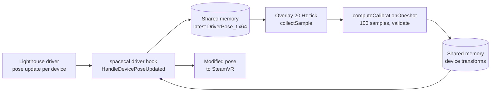
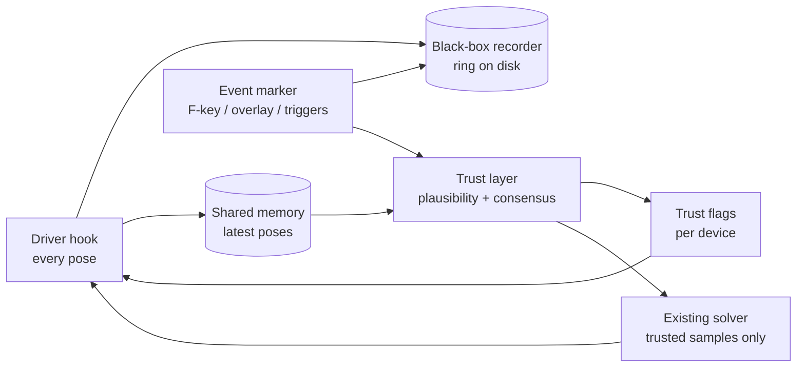
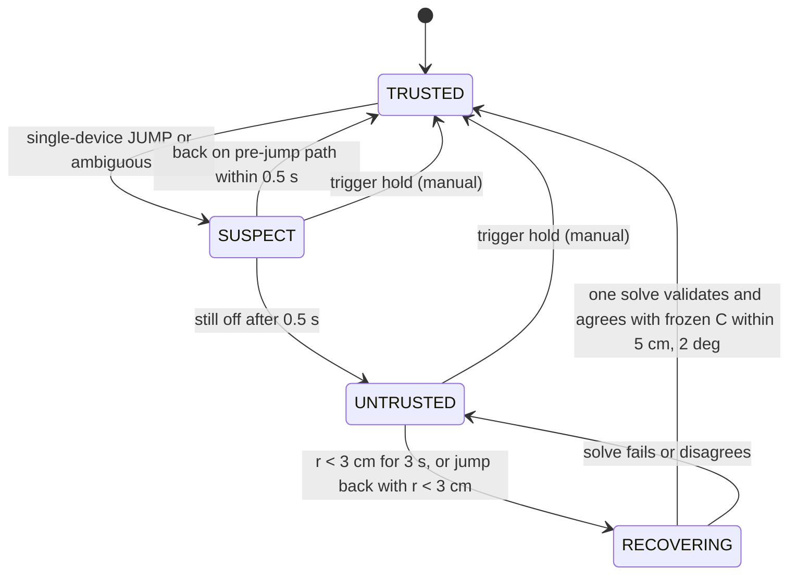

# Glitch-Robust Space Calibrator — Design

Design notes of SpaceCalibrator518, first written 2026-09-18 and extended as the fork grew. Section numbers are
referenced from code comments.

## 1. Problem, goals and non-goals

A fork of Space Calibrator 2.0 (`hyblocker/OpenVR-SpaceCalibrator`, branch `develop`, MIT) that stops a single
glitching Vive tracker from moving the whole lighthouse playspace, and records every such event so the detector
can be tuned from real data.

**The failure.** The head-mounted Vive tracker occasionally jumps sideways by roughly 30 cm within one frame,
holds that offset for seconds to minutes, then jumps back. Likely causes are base-station ambiguity and
reflections. During the offset the HMD (Quest, inside-out), both controllers and the body trackers all keep moving
normally. Space Calibrator 2.0 only ever compares the HMD with the head tracker, so it reads the jump as "the
lighthouse universe moved" and shifts every tracker with it. With "Enable relative calibration" on, that happens in
the driver within about 0.5 s; with it off, the glitch poisons the next one or two solves.

**Goals**

1. A glitch on any single device never changes the applied calibration. The calibration is frozen at its last good
   value until the device is trusted again.
2. Every suspicious event is captured as raw pose data for all devices, 5 min before and 5 min after, with a marker
   the user can set by hotkey or overlay button.
3. Recovery is automatic: once the device is consistent with the other devices again for a few seconds, continuous
   calibration resumes without a visible jump.
4. Manual override: holding both controller triggers forces a recalibration and re-trusts all devices.
5. Every decision the detector makes is logged with the numbers behind it.

**Non-goals**

- Fixing lighthouse tracking itself; the fork only decides whom to believe.
- Replacing the 2.0 solver.
- Linux support in the first iteration (2.0 keeps compiling for Linux; hotkey and testing target Windows).
- Full-body IK in version 1. Body-tracker consistency starts with pairwise distances and velocities; IK is a
  version-2 accuracy feature (section 11).

## 2. Baseline: how 2.0 behaves today

The glitch propagates because the only two devices the calibration ever compares are the HMD and the head tracker,
and because the driver applies whatever the overlay (or, in relative mode, the live head-tracker pose) tells it,
without any notion of trust.

The driver hooks every pose update, stores the latest raw pose per device in shared memory and applies the current
transform to the outgoing pose. The overlay polls the shared buffer, so it sees only the newest pose per device at
each poll. Full-rate data exists only inside the driver.

| Aspect | Code (`develop`, 2026-09-05) | Consequence for a head-tracker glitch |
| --- | --- | --- |
| Sample validity | `collectSample`: `poseIsValid` and `Running_OK` only | A reflection-induced jump still reports Running_OK, so it enters the buffer |
| Sample window | 100 samples (Fast) with enough rotation variance; solve, drop the oldest 50 | A glitch can drive one or two solves |
| Validation | RMS < 0.1 m, not worse than last RMS, axis variance, rotation variance | Rejects large glitches; a 20–30 cm offset over part of the window can pass |
| FixedWorld anchor mode | One world transform; driver lerps (large delta: 2.0/s) | Wrong solve moves all trackers within about 1 s |
| HmdRelative anchor mode | Driver recomputes the world transform every frame from HMD × stored offset × inverse head-tracker pose | Head-tracker jump moves all trackers within about 0.5 s, no solve needed |
| Playspace jump auto-fix | Watches `WorldFromDriver` only; default off | Does not see a device jump |
| Other devices | Never read by the calibration | No consensus available |
| Logging | Text log, 60 s metric history in RAM | No raw pose history, nothing to replay |

Useful pieces already there: the driver sees every pose with its `poseTimeOffset`; the overlay holds all 64 raw
poses in `CalibrationManager::m_poses`; the driver has a per-device blend state (`m_cachedCalibrations`) that can be
held instead of updated; the IPC has a versioned command set.

## 3. Architecture overview

Four additions, in this order so that each one produces data for the next: a black-box recorder in the driver, an
event marker, a trust layer in the overlay with a trust gate in the driver, and trigger-hold recalibration.

| Component | Lives in | Input | Output | Section |
| --- | --- | --- | --- | --- |
| Black-box recorder | Driver (`vrserver`) | Every raw `DriverPose_t` with timestamp | Rolling chunks on disk, promoted to an event folder on marker | 4 |
| Event marker | Overlay (hotkey, button), driver (controller combo) | F-key, overlay button, trigger hold | Marker record, saved event folder | 4, 8 |
| Plausibility checks | Overlay 20 Hz tick (later per frame in the driver) | Latest pose per device | Per-device jump / velocity / acceleration flags | 5 |
| Consensus and trust state | Overlay | Plausibility flags, pairwise distances | Trust state per device, event log lines | 6 |
| Trust gate | Driver | Trust flags via shared memory | Holds the last good correction | 7 |
| Solver gating | Overlay | Trust state | `collectSample` skips untrusted devices; history kept | 7 |
| Trigger-hold recalibration | Overlay | Both triggers held > 1.5 s | Force solve, reset trust, marker | 8 |

Two principles: a calibration is a transform between two universes, not between two devices (a genuine playspace
move shows on every lighthouse device at once, a glitch on one); and when in doubt, hold.

## 4. Phase 1: black-box recorder and event marker

Implemented in `src/driver/black_box.{h,cpp}` (recorder), `src/common/blackbox_format.h` (file format),
`src/overlay/guard/event_marker.{h,cpp}` (markers, hotkey, overlay.json), `src/overlay/guard/guard_config.{h,cpp}`
(settings in `%APPDATA%/space-calibrator/guard.json`), `src/overlay/guard/guard_ui.cpp` (Guard tab),
`tools/blackbox.py` + `tools/plot_event.py` (reader and plot), `tests/blackbox_test.cpp` + `tools/tests`.

**Recording point.** `ServerTrackedDeviceProvider::HandleDevicePoseUpdated` receives every raw `DriverPose_t`.
`BlackBox` takes an 80-byte record per call into a mutex-protected ring; a writer thread flushes it to disk every
250 ms. The hook thread never touches the disk.

**Record types** (80 bytes each, little-endian; see `blackbox_format.h`):

| Type | When | Payload |
| --- | --- | --- |
| POSE | Every pose update | mono time, device, tracking result, flags, poseTimeOffset, position, quaternion (w,x,y,z), velocity, angular velocity |
| WORLD_FROM_DRIVER | When a device's WorldFromDriver changes | translation, quaternion |
| APPLIED | When the applied correction changes by > 0.5 mm or 0.05° | correction translation, quaternion, blend state, scale |
| TRUST | Every trust transition (section 6) | old/new state, reason, residual, three trigger numbers |
| MARKER | Every marker | source, label |
| DEVICE / TEXT | Once per chunk per device / marker folder | 64 chars per record, several records per string |
| SESSION | First record of every chunk | dropped records, ring high-water mark, flush interval |

**Files.** `%APPDATA%/space-calibrator/blackbox/live/<session>_<index>.scb`, one chunk per 60 s, header with format
version, spacecal version, monotonic and unix start time. Retention keeps the live window (default 10 min) plus the
open chunk. A marker at T promotes the chunks covering T−5 min … T+5 min into `blackbox/events/<folder>/` as they
close (the open chunk is re-copied every 10 s), then writes `driver.json` and copies the driver log. The overlay
writes `overlay.json` (calibration state, device table, config) and `log_overlay.log` into the same folder at mark
time and again after the post window. Markers closer than 10 min share one folder.

**Size.** 80 B × 10 devices × 250 Hz is 200 kB/s, 12 MB per minute, about 120 MB per 10 min window; RAM under
2 MB. The measured rate per device is shown by `python -m tools.blackbox info <event>`.

**Marker sources**: global hotkey (polled `GetAsyncKeyState`, default F9, configurable), "Mark event" button on
the calibration page and the Guard tab, trigger hold (section 8), automatic on trust transitions (capped at 20 per
session). The overlay names the folder (`yyyy-mm-dd_hh-mm-ss_<source>`) and sends `IPC_COMMAND_MARK_EVENT`
(protocol version 6).

**Replay.** The detector (sections 5–6) is a pure function over pose records, compiled into the overlay and into a
command-line replay tool so what is tuned offline is what runs online.

## 5. Phase 2a: per-device plausibility

Each device gets a plausibility flag every tick from its own motion alone; the consensus in section 6 decides.

| Check | Formula | Flag when | Why |
| --- | --- | --- | --- |
| Position jump | u = ‖Δp − v̄·dt‖, v̄ = mean of the previous and current reported velocity, capped at 10 m/s | u > v_unexplained·dt + j_tol (1 m/s, 3 cm); without a reported velocity ‖Δp‖ > v_max·dt + j_tol (4 m/s, 3 cm) | A relocation moves p without a matching velocity; a fast real motion comes with one |
| Reported vs observed velocity | e = ‖(p(t)−p(t−1))/dt − v_reported‖ | e > 1.0 m/s | IMU velocity is smooth; a relocation moves p without a matching v |
| Acceleration | a = ‖v(t) − v(t−1)‖/dt | a > 60 m/s² | Hands and feet peak around 30 m/s² |
| Rotation jump | angle(q(t), q(t−1)) − ω̄·dt, ω̄ = mean reported angular speed, capped at 3000 °/s | > 200 °/s·dt + 10°; without angular velocity angle > 400 °/s·dt + 10° | Same idea for orientation |
| Tracking result | `result`, `poseIsValid` | not Running_OK | IMU-only extrapolation is not trustworthy |
| Stale pose | p(t) == p(t−1) exactly | for > 0.25 s | Device stopped updating |

Flags: `JUMP` (position or rotation jump), `NOISY` (velocity or acceleration only), `STALE`, `NOT_TRACKING`, else
`OK`. The triggering numbers go into the TRUST record.

**Velocity-aware jumps (2026-09-30).** The fixed bound flagged fast real motion and missed small relocations. In
one 7-hour session the Index controllers swung past
4 m/s often enough to flicker SUSPECT hundreds of times, while a foot standing still that jumped 6 cm down and 4 cm
forward in one frame (00:38:04) passed under the 9.7 cm bound. The driver reports the IMU velocity with every pose;
real motion agrees with it, a relocation does not. So the check measures the part of a step the reported velocity
does not explain. The same test applies to the pairwise distances of section 6 when both ends report a velocity.
Devices that report exactly zero velocity keep the fixed bounds. Replay results in section 10.

## 6. Phase 2b: consensus, trust states and recovery

A jump is a glitch when one device shows it and the others do not; a playspace move when all devices of one
universe show it together. Recovery is decided by the one rigid relationship: the head tracker sits at a fixed
offset from the HMD, and the glitch is by definition a departure from that offset.

Devices are grouped by `Prop_TrackingSystemName_String` into the reference universe (HMD and its controllers) and
the target universe (lighthouse). Consensus runs inside the target universe; the HMD is never distrusted.

| Pattern | Reading | Action |
| --- | --- | --- |
| Exactly one target device JUMPs, ≥ 2 other target devices OK | Single-device glitch | Device → SUSPECT; calibration frozen |
| All tracking target devices JUMP together, one rigid transform fits with residual < 3 cm | Playspace jump | Apply the fitted delta at once, no distrust, marker `auto` |
| Several but not all JUMP, or deltas disagree | Ambiguous | All jumping devices SUSPECT; frozen |
| Only the HMD JUMPs | Reference discontinuity (re-center) | Clear sample history, allow immediate re-solve |
| One JUMPs, fewer than two jurors | Unverifiable | SUSPECT anyway |

Pairwise distances are the second witness: a distance between two body points changes at most at ~6 m/s, and
HMD↔head-tracker in calibrated space is constant to within 2 cm. When every distance involving device i steps at once
while the others do not, i is the odd one out.

Head-tracker residual r(t) = distance between the expected tracker pose H(t)·C_L and the calibrated raw pose.
Healthy: under 2–3 cm. During the glitch: about the step (30 cm). r at the step is stored as r_step.

The calibration is frozen from the first SUSPECT tick; the device's samples are dropped; nothing is applied again
until the rigid relationship holds and one fresh solve agrees with what was frozen. If the offset never goes away
the device stays UNTRUSTED, the body keeps the frozen calibration, and only HMD drift goes uncorrected until the user
holds the triggers. Slow drift raises r as a ramp (well under 1 cm/min), never a step; while UNTRUSTED, a residual
within 5 cm of r_step means the same glitch. A body tracker that JUMPs alone does not affect the calibration but is
excluded from the consensus while not TRUSTED.

**Shift window (2026-09-30).** A playspace move does not reach every device in the same frame. At 05:41:02 the
lighthouse universe moved 13 cm; five devices showed it in one frame, the head tracker, which had no fresh pose in
that frame, in the next, so frame by frame it read as a single-device glitch of the head tracker. Now the first jump
in the target universe opens a window of `t_shift_window` (0.15 s). Every tracking target device sums its unexplained
steps over its fresh samples since the window opened; the verdict falls once every device has either shown a step
or delivered a quiet fresh sample, or when the window runs out. Two or more displaced devices, none quiet, and one
rigid transform that fits them all within `jump_fit_residual` make a playspace jump (fixed mode: the calibration is
corrected by the fitted delta). Otherwise each displaced device is judged alone, as in the table. While the head
tracker's verdict is pending, the driver holds it.

**Reference discontinuity threshold.** An HMD step counts as a re-center only when its unexplained part is at least
`ref_jump_min` (10 cm) and no shift window is open; smaller HMD steps no longer reset the residual state.

**The head tracker is judged against the applied calibration (2026-09-30).** The residual used to be judged against
the calibration frozen when the head tracker was last trusted. In observe-only mode the solver keeps applying, so
the head tracker stayed UNTRUSTED from 02:10 to 06:20 although the solver had long corrected the calibration. The
trust layer now follows the calibration the solver applies at every tick. When a solve or correction moves the
head tracker's expected pose by more than `r_ok` at once, the learned estimate (fixed mode: the HMD-local offset
C_L; relative mode: the world calibration) is re-anchored to the new calibration: the solver's word on the rigid
offset. Without this, a 10 cm startup solve, a 6 cm continuous solve and playspace corrections of 12 and 20 cm each
left the head tracker UNTRUSTED for the rest of its replay segment, because the estimate is only learned while the
tracker is trusted. A glitch without a calibration change is still judged against the old estimate; with hold on,
the solver does not apply while the tracker is in doubt, so a glitch cannot re-anchor itself. In observe-only mode a
solve that absorbs a glitch re-anchors too; the body follows the solver there anyway. A head tracker whose offset to
the HMD changes for good (headset seated differently) still stays UNTRUSTED until the trigger hold.

## 7. Phase 3: trust gate and integration points

The driver never decides trust; it receives one flag per device and, when the head tracker is untrusted, holds its
last good correction instead of recomputing it.

Driver: in `HandleDevicePoseUpdated` (relative branch) skip the `worldCalib` recompute when reference or target is
not TRUSTED, leaving `m_cachedCalibrations[device].pose` and its blend state untouched. Shared memory gains a third
block (64 × {state, reason, residual, since}) written by the overlay, plus `IPC_COMMAND_SET_DEVICE_TRUST`. Trust enum
shared by both sides: `TRUSTED = 0, SUSPECT, UNTRUSTED, RECOVERING`; anything other than TRUSTED is hold.

Overlay: `src/overlay/trust/plausibility.cpp` (section 5, pure function), `src/overlay/trust/consensus.cpp`
(section 6), run once per tick from `CalibrationManager::calibrationTick` before the per-calibration ticks;
`collectSample` returns invalid when reference or target is not TRUSTED; `computeCalibrationOneshot` returns a new
`CalibrationError::DeviceUntrusted` without touching `m_sampleHistory` / `m_lastRmsError`; in RECOVERING the solve
runs but applies only if it agrees with the frozen calibration within 5 cm and 2°; `makeCalibrationLocal` also runs in
fixed-world mode so C_L exists for the residual.

Fork hygiene: branch from `develop` at 2026-09-05 (`06ce8fbf`), keep changes in `spacecal::blackbox`,
`spacecal::guard`, `spacecal::trust`; touch upstream functions in as few lines as possible; rebase weekly.

## 8. Phase 4: trigger-hold recalibration

| Setting | Default | Behaviour |
| --- | --- | --- |
| Apply continuous updates only while both triggers are held | off | 1.5.1's `requireTriggerPressToApply` on the 2.0 solver |
| Trigger hold as manual override | on with continuous calibration | Both triggers 1.5 s: marker, all devices TRUSTED, clear samples, `forceNextCalibration()` |

Input via an `IVRInput` action manifest (`/actions/spacecal/in/hold_recalibrate`, bound to trigger click on both
hands), `GetControllerState` as fallback. Both controllers must be `Running_OK`; releasing either hand resets the
timer. Haptic pulse on accept and on applied solve. Every accepted hold is a MARKER with source `triggers`.

## 9. Parameters and initial values

All in `guard.json` under `trust` (once section 5/6 land); starting points, to be confirmed from recordings.

| Parameter | Initial | Basis |
| --- | --- | --- |
| `v_unexplained` | 1 m/s | step the reported velocity does not explain (section 5) |
| `rot_unexplained_dps` | 200 °/s | rotation the reported angular speed does not explain |
| `v_body_max`, `w_body_max_dps` | 10 m/s, 3000 °/s | cap on the velocity that may explain a step |
| `v_max` | 4 m/s | only for devices without a reported velocity |
| `j_tol` | 3 cm | lighthouse noise + one tick |
| `v_err_max` | 1.0 m/s | IMU velocity is smooth |
| `a_max` | 60 m/s² | 2× normal peak |
| `rot_max` | 400 °/s + 10° | only for devices without a reported angular velocity |
| `t_shift_window` | 0.15 s | a playspace move reaches every device within two to three frames |
| `ref_jump_min` | 10 cm | HMD steps below this are tracking corrections, not re-centers |
| `t_stale` | 0.25 s | 5 ticks |
| `t_confirm` | 0.5 s | catches one-frame spikes |
| `r_ok` | 3 cm | healthy r < 2 cm |
| `t_recover` | 3 s | longest oscillation at glitch end |
| `d_agree`, `a_agree` | 5 cm, 2° | larger than solve scatter |
| `r_same_glitch` | 5 cm | drift over minutes is well under |
| `jump_fit_residual` | 3 cm | rigid fit over all devices |
| `n_jurors` | 2 | head tracker + two others |
| `t_hold` | 1.5 s | longer than a game trigger pull |
| hotkey | F9 | unused by SteamVR and most games |
| recorder window | 10 min live, 5 + 5 around a marker | the ask |
| auto markers per session | 20 | disk protection |

Tuning: ten marked events and two hours of healthy play; sweep the per-check percentiles on healthy data, then confirm
every event classifies within one tick with no healthy SUSPECT.

## 10. Testing and validation

Accepted when every recorded real glitch is classified within one tick, no device is distrusted during two hours of
healthy play, and the replay tool reproduces the live decisions from the recording.

- `spacecal-replay run <folder>` replays the POSE records of any folder of chunks through plausibility and consensus
  at a chosen tick rate (`--hz`) and compares with the live TRUST records. The summary lists transitions, events,
  re-anchors and each device's time outside TRUSTED. Fixed-mode calibration: by default the APPLIED records (what the
  live run applied); `--corrected-calibration` adds the replay's own playspace corrections that the live run did not
  make; `--own-calibration` uses only the replay's corrections (short synthetic recordings).
- `tools/analyze_session.py <session>` streams a whole session (hours) into per-minute tables, trust transitions,
  calibrations and the unexplained-step statistics used to set section 9.
- `tools/plot_event.py <event>` draws position per device, marker, trust transitions and distances to device 0.
- Synthetic glitch injection via a debug IPC command that offsets one device's raw pose for a duration (planned).

| Case | Expected |
| --- | --- |
| Head-tracker step, 30 cm, 20 s | SUSPECT within one tick, UNTRUSTED at 0.5 s, body does not move, RECOVERING within one tick of the step back |
| One-frame spike | SUSPECT then TRUSTED next tick, no visible effect |
| Hip tracker step | Hip distrusted, calibration untouched |
| Playspace jump | Corrected within one tick, nothing distrusted |
| Quest re-center | HMD discontinuity logged, re-solve, nothing distrusted |
| 30 min healthy play | no transitions |
| Trigger hold during glitch | marker, all TRUSTED, forced solve, haptics |
| Recorder, 60 min, 10 devices | chunks rotate every 60 s, < 130 MB on disk, no drops |
| Old overlay + new driver | pairing refused with a clear log line |
| Fast head motion | no SUSPECT transitions |

**Replay of a 7-hour session (2026-09-30, 22 segments of 20 minutes).** Old = the logic before the
velocity, window and anchor changes; both runs get the calibration the live run applied, so they see the same input.

| | Old, 60 Hz | New, 60 Hz | Old, 30 Hz | New, 30 Hz |
| --- | --- | --- | --- | --- |
| Head tracker outside TRUSTED | 6,419 s | 1,591 s | 4,558 s | 1,569 s |
| Index controllers #14 / #16 to SUSPECT | 142 / 75 | 17 / 18 | 343 / 297 | 11 / 16 |
| Single-device jumps / back on path within 0.5 s | 242 / 217 | 86 / 24 | 632 / 631 | 54 / 10 |
| Playspace jumps recognised | 11 | 34 | 5 | 31 |
| Hip and feet outside TRUSTED | 155 s | 314 s | 312 s | 225 s |

Most of the remaining head-tracker time falls on the first minutes (headset going on, the Quest re-localising by up
to 1.4 m) and on one 15-minute stretch at 03:55 after a 9 cm shift the live run never corrected; with the replay's
own correction (`--corrected-calibration`) that stretch is gone (1,390 s in total at 60 Hz). Hip and feet: the new
check catches 5 to 8 cm relocations the old bound let through (the 00:38:04 foot); each costs about 3.5 s until the
quiet rule trusts the device again, and a body tracker never holds the calibration.

## 11. Risks, open questions and roadmap

Risks: upstream rewrites (keep changes in new files, rebase weekly); the 20 Hz tick too slow for the relative-mode
path (move plausibility into the driver); false positives on fast head motion (tune on healthy recordings);
fewer than two jurors (hold + manual override); a real change of the mount looking like a permanent glitch (trigger
hold accepts the new geometry); recorder disk use (rate logged, thinning rule); hotkey conflicts (configurable key,
overlay button always works); `IVRInput` bindings missing (fallback).

Open questions: output policy for an untrusted body tracker (pass through, hold, or mark not tracking); residual
with or without the driver's latency estimate; a reminder after a long UNTRUSTED; upstreaming after a month; version
2: an IK / body-model layer (Standable-like) that replaces a misbehaving tracker with a virtual one at the estimated
position — designed so it can sit on top of the trust states without changing the detector.

| Milestone | Delivers | Done when |
| --- | --- | --- |
| M0 Baseline build | Fork at `06ce8fbf`, builds beside the Steam beta | Same behaviour as the Steam beta |
| M1 Recorder and marker | Sections 4 + driver glue, hotkey, overlay button, reader | First real glitch saved and plotted |
| M2 Plausibility and trust | Sections 5, 6 with the driver gate | Synthetic 30 cm step no longer moves the body |
| M3 Recovery and trigger hold | Full state machine, section 8 | Real glitch survives end to end |
| M4 Tuning | Section 9 on ≥ 10 real events | Section 10 criteria met |
| M5 Cleanup | Config migration, UI polish, optional upstream PRs | Rebased on current `develop` |

## 12. Implementation notes (2026-09-18, after the first critic review)

Where the code deviates from sections 4 to 8, and why:

- **Driver hold** is a flag bit (`holdRelative`) in the existing per-device transform block instead of a third
  shared-memory block and `IPC_COMMAND_SET_DEVICE_TRUST`: the transform block is already read on every pose update,
  so the hold arrives with the next `apply()` and no new shared memory is needed. Trust transitions reach the black
  box through `IPC_COMMAND_RECORD_TRUST`.
- **IPC commands are queued** in the overlay (`IpcClient::PumpQueue`) and sent one at a time once the driver has
  consumed the previous one (`ipc_client_is_idle`), because the vendored IPC has a single command slot and
  back-to-back dispatches overwrite each other.
- **The HMD-local offset C_L** is estimated inside the trust layer (fixed mode: `H^-1 · C · T`, learnt slowly and only
  while the residual is healthy) instead of running `makeCalibrationLocal` in fixed mode. In relative mode the
  frozen world calibration is likewise a slow blend of the live `H · C_L · T^-1`, never the instantaneous value
  (which is exactly what a glitch corrupts).
- **After an HMD re-center in fixed mode** no residual is judged until the solver applies a new calibration
  (no wall-clock cap); the offset is re-learnt from that solve.
- **Extra states and reasons** beyond the section 6 diagram: `DEVICE_LOST` (a SUSPECT/RECOVERING device that
  stops tracking becomes UNTRUSTED, never TRUSTED by absence), `QUIET` (non-target devices, and the head tracker
  while no calibration exists yet, are trusted again after `t_recover` without a jump), `RESIDUAL_HIGH` (head
  tracker drifted from the rigid offset without a visible step; no juror requirement), `DISTANCE_ODD_ONE_OUT`
  (the pairwise-distance witness alone), `JUMP_WHILE_RECOVERING`.
- **No calibration yet**: the solver is never gated while the calibration is invalid, so the first calibration can
  always be collected.
- **Observe-only mode**: `trust.hold_enabled = false` (the default for the first sessions) keeps the states, logs,
  markers and TRUST records but leaves the solver and driver exactly as upstream. Switch it on in the Guard tab once
  a few recordings show no false SUSPECTs.
- **Auto markers** fire only on transitions out of TRUSTED, so a recovery loop cannot burn the per-session cap.
- **Trigger hold** requires both controllers to be `Running_OK`; the 1.5.1 apply-only-while-held option is a
  separate checkbox and never counts as a failed recovery solve.
- **Hold latency**: the trust tick runs every overlay frame, but the driver still lerps for the 1 to 2 ticks until
  the hold flag arrives, so a 30 cm step can move the body by a few centimetres before it is frozen (section 11).
- **Recorder**: records are 80 bytes (not 64) to keep angular velocity; the ring holds 65 536 records; event
  promotion copies at most one chunk per writer iteration so a slow disk cannot stall the ring.
- **Replay** assumes recovery solves agree (it cannot run the solver) and, in fixed mode, follows the APPLIED
  records of the head tracker as the live world calibration (other modes in section 10).
- **Handshake mismatch** is a log line on both sides, as upstream does it; the overlay does not refuse to pair.

## 13. Thin driver: everything else changes live (2026-09-30)

The driver is reduced to what has to run inside vrserver; every behaviour moved into the overlay, which can be closed, replaced and restarted while SteamVR keeps running. Only a change to the driver interface needs a SteamVR restart.

| Part | Lives in | Changed how |
| --- | --- | --- |
| Pose hook, applying corrections, `holdRelative` flag | Driver | SteamVR restart |
| Pose ring publisher (POSE, WORLD_FROM_DRIVER, APPLIED, DEVICE_STATE records) | Driver | SteamVR restart |
| Trust layer, solver gating, trigger hold, calibration records | Overlay | Live overlay swap |
| Recorder: chunks, keep-all archive, events, markers, device info, lifecycle records | Overlay | Live overlay swap |
| Guard tab, settings, thresholds | Overlay | Live overlay swap |

**Pose ring** (`src/common/pose_ring.h`). A named shared-memory ring (`Local\SpaceCalibrator518_PoseRing`, 524,288 slots of 88 bytes, 46 MB, about 3.3 minutes at the measured 2,600 records/s). The driver writes each record under an in-process mutex and publishes it seqlock-style (the slot's sequence number equals the record's index once complete); it never waits for a reader and simply overwrites the oldest slot. The reader detects torn and overwritten slots and counts them as lost. The driver writes a random session id per SteamVR start; the overlay notices a new id and switches to the new session.

**Gapless overlay restarts.** The recorder commits the ring cursor into the ring header after every flush to disk (every 250 ms). A restarted overlay resumes at that cursor and adopts its session's chunks in `live\`, so a session's recording has no gap and no duplicate as long as the overlay is back within the ring's span. A longer absence is written as a `RING_GAP` lifecycle record with the number of lost records. `RECORDER_START` carries f0 = 1 when a recorder continues its session.

**Driver interface** = IPC protocol version + ring layout version. `tools/install.ps1` swaps the overlay live when it is unchanged, and otherwise defers the install to the next SteamVR shutdown (`tools/install-when-closed.ps1`). The overlay refuses to attach to a ring of another layout and says so in the Guard tab.

**Closing the overlay never moves the body.** The driver keeps applying the last transforms it received (upstream behaviour, the overlay sends no reset on exit); in relative mode it keeps recomputing from the HMD and the head tracker every frame, with the hold flag as last sent.

**What remains risky in the driver.** A bug in the hook or the ring writer still takes vrserver down. The writer is 30 lines, tested with four concurrent writer threads against a reader (no torn record in 200,000) and across a simulated overlay restart (every pose exactly once).

**Recorded devices (2026-09-30, first live update).** The recorder keeps the guarded calibration's two tracking systems: the HMD's (oculus: headset and Quest controllers) and the target's (lighthouse: Tundra and Vive trackers, Index controllers, base stations). Devices of other systems are left out unless `recorder.record_other_devices` is set: for example Standable's eight virtual trackers (which report controller type `vive_tracker_*`, so only the tracking system name tells them apart) and Virtual Desktop's two hand-tracking controllers. Only devices whose system is known are left out. A TEXT note in the recording lists what was left out; DEVICE info is still written for every device, with `recorded=0/1`. The trust layer already used only body-worn devices of those two systems (base stations and other systems never vote).

**WorldFromDriver repeated with every pose.** The driver's change test compared the raw quaternion dot product with cos(0.025 deg); lighthouse delivers |q| = 0.99999995, so an unchanged transform failed the test and every pose wrote a WORLD_FROM_DRIVER record (2,300/s, half of all data). The recorder now keeps it only when it changed (normalised test); the driver fix follows with the next SteamVR restart. Data rate after both changes: about 11 MB per minute raw.

**Startup solve.** Upstream forces the first continuous solve after every overlay start, even when it fails a check; on 2026-09-30 00:31 that moved the calibration 13 cm with too little translation variance. With a valid stored calibration the first solve now has to pass the normal checks (`startup.keep_stored_calibration`, default on); it is still recorded with trigger `startup`. Without this, every live overlay swap could shift the calibration.

**One instance, findable window (2026-09-30).** Upstream only guards Steam launches against a second instance. Two launches from a launcher at 05:41 therefore ran a second calibrator and recorder next to the first for 23 minutes. Both wrote the same chunk names, and the second one, failing to find chunks the first had already archived, "cleaned up" after the failed copy by deleting the archive's copies: 05:31 to 05:37 is lost and 05:42 to 06:04 misses about 20 s per minute. The archiver now drops a chunk that is gone from live/, and a failed copy only deletes its own temporary file (`vanished_live_chunk_never_deletes_the_archived_copy`). The overlay now holds the mutex `Local\SpaceCalibrator518_Overlay` for its lifetime, however it was started; a second launch raises the running window (flashes it when Windows refuses the focus) and exits. The window and taskbar icon now come from the exe's multi-size icon resource, and the exe carries version info, so Windows shows "Space Calibrator 518" with the green icon instead of GLFW's generic application icon and "SpaceCalibrator.exe".

**Starts with SteamVR (2026-09-30).** The overlay is its own SteamVR application: `dist\manifest.vrmanifest` with the key `blise518b.spacecalibrator518`. The Steam release keeps `steam.overlay.3368750`, and SteamVR keeps only the first manifest it reads for one key, so the fork used to run as `system.generated.spacecalibrator.exe` and could not be launched by SteamVR. SteamVR's autolaunch flag for the key is the one switch: "Start with SteamVR" in the Guard tab and the startup overlay apps in the SteamVR settings show the same flag. The overlay registers itself through `IVRApplications` at every start (replacing a registration from another folder, turning autolaunch on only at the first registration) and identifies its process with the key, so a start from a launcher runs as the same application. `tools\install_common.ps1` (`Register-SteamVrApp`) writes the same registration into Steam's config while SteamVR is closed, so the first SteamVR start after an install already launches the overlay; an existing autolaunch choice is kept. The driver was always loaded by SteamVR itself (`alwaysActivate`). A second start raises the running window and exits.

**Marker notes (2026-10-01).** A marker the user sets himself (overlay button, hotkey, trigger hold) asks what happened: a one-line field under the marker button, on the main page and in the Guard tab. Enter or Save keeps the note, Later or Esc puts it off; the Guard tab lists every marker of the overlay run with its note, so a note can be added or changed later. After the hotkey the window comes to the front with the cursor in the field, and Enter gives the focus back to the window that had it (`hotkey.raise_for_note`; when Windows refuses the switch the taskbar button flashes). In the SteamVR dashboard the field opens the SteamVR keyboard; the trigger hold's prompt waits there, since the dashboard is usually closed at that moment. The SteamVR keyboard now opens only for text fields in the dashboard, not for the desktop window. A note goes to `notes.txt` and `overlay.json` (`user_notes`) in the event folder and into the recording as a TEXT record (`MARKER_NOTE`, payload "<marker t> <note>", the latest per marker wins), so the keep-all archive and `analyze_session` show it next to the marker. Notes are cut at 400 bytes to fit one text message (`guard/marker_notes.h`).

**Every chunk reads on its own (2026-09-30).** The driver writes WORLD_FROM_DRIVER and APPLIED only when they change, and the recorder's per-chunk reset only let the next one through, which never came while nothing changed: in one session chunks 70 to 140, 190 to 290 and from 340 on had no WORLD_FROM_DRIVER at all, so a replay that started there placed every lighthouse device wrongly (the head tracker 0.7 m off). The recorder now repeats each device's last WORLD_FROM_DRIVER and APPLIED at the start of every chunk, timed just before its first record and marked `b = k_RECORD_CARRIED` (a repeat, not a change; `tools/blackbox.py` shows it as `carried`). Tested end to end through the ring (`every_chunk_carries_the_transforms_in_effect_at_its_start`). A recording that starts after the ring has lost the driver's first transform still lacks it until the next change.

**Live tab (2026-10-02).** A tab next to Calibration that shows the last 10 s, 1 min or 5 min of what the guard and the solver see, the way the old calibrator's graphs did. Every trust tick feeds five-minute buffers (`guard/live_stats.*`); `guard/live_ui.cpp` draws them: four tiles (head tracker error, guard state, calibration, universe shifts); the head tracker's error over time with the trust state as coloured bands and the r_ok / r_high lines; three views of where the head tracker sits compared with where the calibration expects it (from above: right and forward, from the side: forward and up, from behind: right and up; all on one scale, newer dots brighter, rings at r_ok and r_high); the same error split into forward, right and up over time; the applied calibration (x, y, z relative to now, yaw) with every solver proposal as a dot (filled = applied); the glitch meter (each target-universe device's unexplained step against its jump limit, plus one verdict strip per device); and solver health (RMS of each proposal and of the current calibration, axis variance against its threshold, reasons for rejected solves). The head error is the consensus residual as a vector, calibrated minus expected (`TickOutput::targetResidualVec`), turned into a frame that follows the head: forward is the HMD's facing projected onto the floor, up is world up. Every graph explains itself on hover (what it shows, how to read it) under the values at the cursor. While live the plots take no mouse input, so the page scrolls; Pause keeps a frozen copy to look at.

`SpaceCalibrator.exe --live-demo` fills the tab with made-up data for UI work. It does not call VR_Init (which would start SteamVR), does not record, and every half second reads `%APPDATA%\space-calibrator\live_demo.txt` (`scroll=<px>`, `mouse=<x>,<y>`), so the page can be scrolled and hovered for screenshots without touching the desktop. The overlay is single instance, so the demo runs only while the real overlay is closed. Lesson from the first demo run: an overlay that calls VR_Init while SteamVR runs without a headset fails ("Hmd Not Found"), stays open without SteamVR and, being the single instance, keeps the autostarted overlay from running; an install that swaps the overlay live at that moment leaves the next VR session uncalibrated until the overlay is restarted.

**Night report (2026-10-02).** `tools/session_report.py` turns one SteamVR session into a single interactive page (Plotly from cdnjs, the data embedded, so it is one file to keep or share). Six charts, each with a hover explanation: (1) the night device by device: lost tracking, the guard states as they happened live, glitches flagged by the velocity-aware rule, markers and calibration steps over 5 cm; (2) the head tracker error, recomputed for every 1/60 s by `spacecal-replay run --csv` with today's guard (the CSV now also carries the error split into forward, right and up of the headset), as a 30-second median with each second's worst moment, plus the Live tab's three views accumulated over the night; (3) the applied calibration (x, y, z and yaw relative to the night's median) and every proposal by size and outcome; (4) lost tracking or glitches per minute and device; (5) up to eight moments picked automatically (unexplained jumps of 15 cm or more, calibration steps of 10 cm or more, markers set by the user, three or more devices losing tracking within 1.5 s, the head tracker turning untrusted), each with its events, the head tracker error, every device's unexplained step at the 60 Hz tick and its height, read from the chunks; (6) per device, the flags per hour the guard would raise for a given v_unexplained or rot_unexplained_dps, from the histograms `analyze_session` now writes (`hist.csv`, next to the new `vflags.csv` and `losses.csv`). The first minutes before the night's first applied calibration and the last 15 s are left out of the head tracker charts (a new universe after the SteamVR start, stale poses at shutdown). Steps: `python -m tools.analyze_session <id> --tick-hz 60 --out logs/analysis_<id>_60hz`, `python -m tools.replay_session <id>` (hard-links the chunks into 20-minute pieces and replays each with `--hz 60 --csv`), then `python -m tools.session_report <id> --analysis logs/analysis_<id>_60hz --replay logs/replay_csv/<id> --out logs/report_<id>.html`. On 30 Sep the live guard distrusted the head tracker for 4.2 h (before the re-anchoring fix of 3b68078); replayed with today's guard it is 4 min.

**Universe shifts (2026-10-02).** Every lighthouse device reports its pose in driver space with a WorldFromDriver transform; for body-worn devices that is the frame of the base station the universe is built on, and they all share it. When SteamVR re-solves its base stations it changes that shared transform: in the raw world every lighthouse device moves by the same rigid delta while nothing moved, so against the Quest headset the whole body jumps. On 2026-10-02 this happened about 50 times in one session (2 to 28 cm; the session before not once); two were plainly visible in VR: 02:43 (5.7 cm / 1.25 deg) and 04:14 (18 cm / 0.84 deg). The guard missed both: at 02:43 each device's step was barely above its jump limit, at 04:14 one tracker was just coming back from another base station's frame, its step did not fit the rigid delta and the whole shift was judged ambiguous. Upstream's own WorldFromDriver fix (`attempt_auto_fix_playspace_jumps`) is off and follows the head tracker alone, which a tracker switching base station frames would turn into a metres-sized correction.

`trust/universe_watch.*` watches the shared transform itself: two or more body-worn devices switching to the same new transform, with a change of a re-solve's size (2 mm to 0.5 m at the devices, at most 5 deg; another station's frame is metres away), is a shift. The TrustManager then corrects the calibration by exactly that change in the same frame (C_new = C_old * delta^-1, trigger `world_from_driver_jump`, outcome corrected; guard.json `trust.fix_universe_shifts`, fixed mode only, never together with upstream's fix) and hands the trust layer every lighthouse pose in a stable frame (`correction(index) * raw`, with the calibration as `C * global^-1`), so the shift is no step there at all. Devices whose transform lags a frame behind keep the old frame's correction, a first device in a new frame is held for up to 0.25 s for the others, a device in another station's frame stays raw and its jump is judged on its own. When no device has been in the frame for 2 s and two share another one, the universe follows that frame without a correction. Separately, the consensus' rigid fit for playspace jumps now leaves out one device when that makes the others fit (that device is judged alone). The replay tool runs the same watch and corrects in `--corrected-calibration` mode; replays of 02:43 and 04:14 correct both shifts and keep the head tracker trusted, the 6-hour session of 30 Sep shows no shift. Tests: `spacecal_universe_test`.

**Per-device frames (2026-10-03).** The universe watch assumed one shared WorldFromDriver. The 2026-10-02 recording shows otherwise: a device's transform is the frame of the base station it is tracked from (transforms matched against the base stations' own), devices change stations on their own (two trackers sat on other stations for minutes at a time), and SteamVR moves each station separately ("Moving base X ... because of relationship with Y"; every one of 163 such lines in vrserver.txt matched a change of that station's transform, and every move of the main station came with a universe tilt that turns every other station by up to 4.3 deg). So in four hours the watch corrected 22 moves of the main station exactly but missed 8 moves of two other stations under one or two trackers (2 to 8 cm; once a station moved 21 cm on the map and two trackers 7 cm), and its one correction for all devices pushed trackers that sat on another station at that moment by 1 to 9 cm (7 times). Body devices saw 137 frame changes in those four hours; 129 of them moved the device by more than 2 cm in the raw world.

`trust/frame_corrector.*` corrects per device. A pose is raw = W * P, W the station's frame on SteamVR's map, P the pose measured against the station; a map change moves W and never P, and the device's own motion never moves W. Each device has a correction Q (raw to stable). A change of W within the same station's frame family (at the device at most 1 m and 10 deg; stations differ by metres and tens of degrees) is absorbed exactly, Q = Q * W_old * W_new^-1. A change to another station's frame absorbs the step between the last sample before and the first after when the two are at most 50 ms apart and the step is at most 25 cm / 10 deg (SteamVR's maps of two stations rarely agree; a bigger step is shown as it is), never for the head tracker, whose own jumps the trust layer has to see. Every held correction slides back to SteamVR's map at 1.5 cm/s and 0.5 deg/s at the device, so corrections never pile up and nothing is held that SteamVR has actually changed; a device back from more than 0.5 s without tracking starts on SteamVR's map. SteamVR's map is pinned at the reference family, the frame of the station the head tracker is tracked from: G = S_r * W_ref^-1 with W_ref the head tracker's own version of that frame (station records run ahead: once the main station's record moved 8 cm and no device ever took that version; other devices' versions, see "Reference version" below). G is the calibration fix as before (C_new = C_old * delta^-1, trigger `world_from_driver_jump`), the trust layer gets `correction(index) * raw` with `C * G^-1`, and the driver gets per device the calibration times its pin, `C * G^-1 * Q` (`TrackingSystemCalibration::apply` / `applyQuiet`; the TrustManager resends the transforms when a pin moves by more than 0.2 mm or 0.005 deg, one shared-memory write for all devices). The driver is unchanged. guard.json: `trust.per_device_frames` (off = the shared-frame watch), `trust.frames_slide_cm_s`, `trust.frames_slide_deg_s`, `trust.frames_absorb_switches`. Corrected moves no longer set auto markers (on 2026-10-02 they used up the session's 20 by 07:00; the glitch collection finds them from the CALIBRATION records anyway).

Validated before writing it: a Python prototype over a four-hour recording (pose windows of 6 s around every move) took the frame-change steps above 2 cm from 129 to 0 (largest 1.2 cm), left every other step within 0.2 mm of raw, kept the head tracker exact and found the same 22 corrections of the calibration as the live watch. `spacecal-replay run <folder> --corrected-calibration` runs it by default (`--shared-frame` for the old watch) and prints the frame events. Tests: `spacecal_frames_test`.

**Reference version (2026-10-04).** The first version took W_ref from the first tracking device that showed a new version of the reference family, with a short history so that a lagging device could not move it back. At 02:13:11 the head tracker changed from one station to another in the very frame SteamVR moved that station by 10 cm; the trackers on it took the new version 1 to 5 ms later. The head tracker's change set the reference to the new version, then a tracker still on the old version, read in the same tick, counted as a reference move back to it (10.3 cm / 2.41 deg, "calibration corrected"), and the history kept the reference on the old version once every device had the new one. From then on every pin was the difference of the two versions: each lighthouse device, the head tracker included, sat 8 to 10 cm and 2.4 deg off the calibration the solver kept finding, until the overlay restarted at 02:54 (measured from the recording: APPLIED of every device against the last calibration). The solver calibrates against the head tracker's raw poses, so the head tracker's pin has to stay identity: W_ref is now the head tracker's own version whenever it tracks, and only the head tracker moves it (a REFERENCE_MOVED when its frame changes within the family, a REFERENCE_SWITCHED when it changes stations). A device on another version of the head tracker's station is held in the head tracker's version, and a station move seen on body devices before the head tracker becomes the calibration fix when the head tracker shows it. Test: `the_head_tracker_switching_onto_a_station_that_moves_in_the_same_frame_leaves_no_offset`.

**Head mount (2026-10-05).** The head tracker is strapped to the headset, so its pose in the headset's frame, X = H^-1 * C * T, stays put while the calibration does not: SteamVR re-solves its base stations at every start (2026-10-04 20:50: the head tracker's station moved 21 cm in the first two minutes, before the stored calibration was active) and the Quest may re-center. Six recorded sessions (2026-09-30 to 2026-10-04, measured over the glitch collections) put the tracker at right -1.0 to -1.5 / up 10.4 to 10.8 / back -2.9 to -3.4 cm, but its rotation against the headset differed by 2.5 to 7.3 deg between sessions, so only the position is used (`trust.head_mount_*` in guard.json; `HeadMountParams::use_rotation` for a rigid mount). `trust/head_mount.*` learns X while the head tracker is trusted, sits within 2 cm of where the calibration expects it and the calibration's RMS on the solver's samples is under 1 cm (a plain average for the first five minutes, then one with a 5 minute time constant), and keeps it in `head_mount.json` per head tracker and headset; after two minutes of learning it is used. At every overlay start, once headset and head tracker track and hold still for 1.5 s, the stored calibration is shifted so that the head tracker lands at X (trigger `startup`, outcome `corrected`; kept when it is within 1.5 cm, refused beyond 80 cm or 25 deg). Every continuous solve that passes the solver's own checks is then also judged against X: one that would put the head tracker more than 5 cm from it is rejected (`CalibrationError::HeadMountDisagrees`), unless it puts it closer than the calibration in use (after SteamVR moved its base stations on 2026-10-01 01:12 and 2026-10-02 04:00, replayed, the first solve got the head tracker from 15 to 5.5 cm; rejecting it kept the worse calibration) or five in a row agree with each other on another place, which is taken as a re-mounted tracker and learned anew. This catches the low-variance solves that walk the calibration up or down while lying still. The trigger hold anchors to X as well when it is known. Checked against the recordings (2026-10-05, 16 h of glitch windows and one full session): the 995 continuous solves the solver applied put the head tracker a median 0.7 cm from X, 90% within about 2 cm, so X is as good a reference as the solver itself. Tests: `spacecal_head_mount_test`. The rotation of the stored calibration is still only corrected by the solver; saving the base stations' frames with the calibration (to undo SteamVR's map changes between sessions) is the next step.

**Head mount fix (2026-10-05).** The solver needs head movement to find the position; with X known, one frame tells how far the calibration is off at the head: the gap g = H * X - C * T. `HeadMountFix` (trust/head_mount.*) slides the calibration's translation by it at 1.5 cm/s once it has been above 2.5 cm for 5 s while headset and head tracker move slower than 20 cm/s and the headset turns slower than 30 deg/s, and stops below 0.5 cm (trigger `head_mount_fix`, outcome `corrected`, one record per fix; `trust.head_mount_fix*` in guard.json, a switch in the Guard tab). The gap is only the calibration's error while the head tracker itself is right, so a glitch must not take the body along: after the gap steps by more than 3 cm within one tick without the calibration changing (8 cm while moving fast) nothing is fixed for 20 s, the gap must not be trending (slope under 0.25 cm/s over the 5 s), a fix is undone at once when the gap without it falls below 1 cm (its cause went away), and gaps over 50 cm are left to the solver. The trust state is not used: on the night of 2026-10-03 the guard had the head tracker as untrusted for half of the time it sat more than 3 cm off, while the calibration was what was wrong (2026-10-04 06:08 to 06:11). A calibration applied by anyone else replaces the fix, X is not learned while a fix is in place, and with the fix on the solver prior rejects solves more than 2.5 cm from X (instead of 5 cm) unless they improve on the calibration in use, so that the solver and the fix never take turns moving the body between their two answers. Simulated beforehand with a Python replay of the same rules over the recordings (16 h: the glitch windows of 2026-09-29 to 2026-10-04 and one full session, with the recorded solver calibrations replacing the fix): the time the head tracker sat more than 3 cm from X went from 13.6% to 6.2% (more than 5 cm: 7.9% to 3.6%); at the user's markers 11.7 cm went to 1.2 cm (2026-10-04 06:10, 1.5 minutes before the solver got there), 3.6 to 0.6, 3.8 to 1.7 and 4.6 to 1.7 cm. A version that waits for the head tracker to be trusted got only to 7.8%; one without the jump and trend rules moved the calibration 192 cm in total while the head tracker had just jumped on its own (2026-10-04 08:26 it chased a tracker sliding back after a glitch, 9 cm at a time), with them 35 cm, and it was more than 2 cm worse than no fix for 26 s in the 16 h, all right after SteamVR moved its base stations. Startup offsets and other jumps of tens of cm are left to the startup placement, the trigger hold and the solver. Tests: the HeadMountFix cases in `spacecal_head_mount_test`.

**Glitch collection (2026-10-02).** The keep-all archive grew by 4 to 7 GB a night, almost all of it normal tracking. `tools/glitch_collection.py` condenses every finished session to the minutes around its glitches in `blackbox/glitches/<session>/<time>_<kind>/` and deletes the session's archive and event folders. Moments come from the recording's own records: major ones (120 s before to 60 s after) are a marker you set, a SteamVR universe shift (body devices switching to the same new WorldFromDriver), a calibration correction or a step of 10 cm or more, the head tracker leaving TRUSTED or losing tracking for 3 s, three or more devices leaving TRUSTED or losing tracking within 1.5 s; minor ones (15 s each side) are any other device leaving TRUSTED. A window folder holds the trimmed chunks (poses at full rate within 5 s of a moment, at most 120 per second and device elsewhere, every other record kept; each device's WorldFromDriver, APPLIED and device info carried to the window start, so the folder reads and replays on its own), the session's `overlay.json`, the user's marker notes, `summary.txt` and `log.txt` (the overlay log of the window without per-frame noise). A collection is written to `<session>.partial` and renamed only when every window reads back; only then is anything deleted. The session being recorded (chunks in `live/`, or written in the last 15 minutes) is never touched. Old overlay logs are rewritten without the per-frame noise (`--logs`). The overlay starts the script in the background a minute after it starts (`guard/housekeeping.*`, guard.json `recorder.glitch_collection`, only when `tools\` and `.venv\` sit next to the install; output in `logs\glitch_collection.log`). First run on 2026-10-02: five sessions, 13.4 GB of recordings to 1.7 GB in 135 windows; overlay logs 660 MB to 210 MB.

**Installer (2026-10-04).** The release zip needs a folder that stays put (SteamVR loads the driver from it), SteamVR closed while `use-fork-driver.bat` runs, and the bat to switch back before the folder is deleted. `install/SpaceCalibrator518.iss` (Inno Setup 6, built by `tools/make_release_zip.ps1` next to the zip) installs per user without admin rights to `%LOCALAPPDATA%\Programs\SpaceCalibrator518`, waits for SteamVR and any Space Calibrator to be closed, then runs `use-driver.ps1 fork` and `steamvr-app.ps1 register` from the install folder (output in `setup-steamvr.log` there). `steamvr-app.ps1` writes what the overlay registers through IVRApplications when it runs: the manifest in Steam's `appconfig.json` (other manifests with the same app key are dropped, since SteamVR keeps only the first one it reads) and autolaunch on when SteamVR has no setting for the app yet. Uninstall: `steamvr-app.ps1 unregister`, then `use-driver.ps1 steam`, or `none` (new: no Space Calibrator driver at all) without the Steam version. Settings and recordings in `%APPDATA%\space-calibrator` stay. Upstream's `install/installer.nsi` (1.5, copied the driver into SteamVR's own folder with admin rights) is not used.
